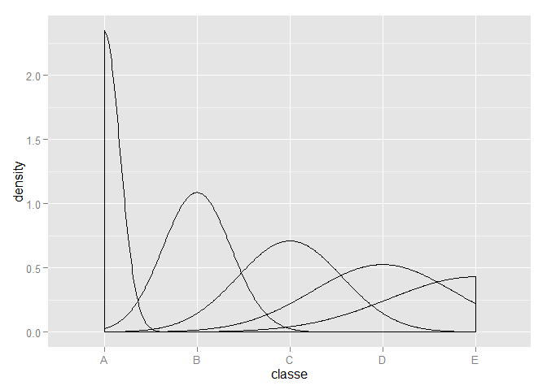

# Qualitative Activity Recognition
HyoJung Kim  
Sunday, September 21, 2014  
# 1. Overview 
People rarely quantify how well they do executing an activity. 
So, data from the 4 sensors(belt, forearm, arm, and dumbell of 6 participants) generating some features on the Euler angles (roll, pitch and yaw), as well as the raw accelerometer, gyroscope and magnetometer readings is utilized. For the Euler angles of each of the four sensors, we calculated eight features: mean, variance, standard deviation, max, min, amplitude, kurtosis and skewness, generating in total 96 derived feature sets. More information is available from the website here: http://groupware.les.inf.puc-rio.br/har (see the section on the Weight Lifting Exercise Dataset). 

Based on training data provided, we apply machine learning algorithm and finally make predictions on our behaviors. 

* Exactly according to the specification (Class A), 
* throwing the elbows to the front (Class B), 
* lifting the dumbbell only halfway (Class C), 
* lowering the dumbbell only halfway (Class D) 
* and throwing the hips to the front (Class E). 

# 2. Prepare data 
Eliminate less helpful features to predict class for qualitative activity recognition. Some index or time series features with NA value are finally removed. 


```r
alldata <- read.csv("pml-training.csv")
# Remove first 6 columns that is not related to qualitative Activity Recognition context
adjdata <- alldata[, -c(1:6)]
# Remove columns with near zero value with less variance 
library(caret)
nsv <- nearZeroVar(adjdata, saveMetrics=TRUE)
adjdata <- adjdata[,-c(which(nsv$nzv))]
# Remove columns having NA values
adjdata <- subset(adjdata, select= colSums(is.na(adjdata))==0 )
dim(adjdata)
```

```
## [1] 19622    54
```

```r
# Split data 
inTrain <- createDataPartition(y=adjdata$classe, p=0.75, list=FALSE)
training <- adjdata[inTrain, ]
testing <- adjdata[-inTrain, ] # validation data set 
# plot training data
qplot(classe, data=training, geom="density")
```

 

# 3. Build Model based on Random Forest 
Compared to other models, random forest model shows relatively fast execution in speed with the highest accuracy on predictions, so random forest model is finally selected.

```r
library(randomForest)
```

```
## randomForest 4.6-10
## Type rfNews() to see new features/changes/bug fixes.
```

```r
rfModFit <- randomForest(classe ~ ., data=training, ntree = 300)
print(rfModFit)
```

```
## 
## Call:
##  randomForest(formula = classe ~ ., data = training, ntree = 300) 
##                Type of random forest: classification
##                      Number of trees: 300
## No. of variables tried at each split: 7
## 
##         OOB estimate of  error rate: 0.24%
## Confusion matrix:
##      A    B    C    D    E class.error
## A 4184    1    0    0    0   0.0002389
## B    5 2841    2    0    0   0.0024579
## C    0    8 2559    0    0   0.0031165
## D    0    0   16 2395    1   0.0070481
## E    0    0    0    3 2703   0.0011086
```

# 4. In sample error with training data set (p=0.75)

```r
pred <- predict(rfModFit, training)
library(caret)
# get expected out of sample error (OOB - Out of Bag error rate) 
print(rfModFit)
```

```
## 
## Call:
##  randomForest(formula = classe ~ ., data = training, ntree = 300) 
##                Type of random forest: classification
##                      Number of trees: 300
## No. of variables tried at each split: 7
## 
##         OOB estimate of  error rate: 0.24%
## Confusion matrix:
##      A    B    C    D    E class.error
## A 4184    1    0    0    0   0.0002389
## B    5 2841    2    0    0   0.0024579
## C    0    8 2559    0    0   0.0031165
## D    0    0   16 2395    1   0.0070481
## E    0    0    0    3 2703   0.0011086
```

```r
confusionMatrix(pred, training$classe)
```

```
## Confusion Matrix and Statistics
## 
##           Reference
## Prediction    A    B    C    D    E
##          A 4185    0    0    0    0
##          B    0 2848    0    0    0
##          C    0    0 2567    0    0
##          D    0    0    0 2412    0
##          E    0    0    0    0 2706
## 
## Overall Statistics
##                                 
##                Accuracy : 1     
##                  95% CI : (1, 1)
##     No Information Rate : 0.284 
##     P-Value [Acc > NIR] : <2e-16
##                                 
##                   Kappa : 1     
##  Mcnemar's Test P-Value : NA    
## 
## Statistics by Class:
## 
##                      Class: A Class: B Class: C Class: D Class: E
## Sensitivity             1.000    1.000    1.000    1.000    1.000
## Specificity             1.000    1.000    1.000    1.000    1.000
## Pos Pred Value          1.000    1.000    1.000    1.000    1.000
## Neg Pred Value          1.000    1.000    1.000    1.000    1.000
## Prevalence              0.284    0.194    0.174    0.164    0.184
## Detection Rate          0.284    0.194    0.174    0.164    0.184
## Detection Prevalence    0.284    0.194    0.174    0.164    0.184
## Balanced Accuracy       1.000    1.000    1.000    1.000    1.000
```

```r
confusionMatrix(pred, training$classe)$overall['Accuracy']
```

```
## Accuracy 
##        1
```

# 5. Out of sample error estimation with cross-validation data set (p=0.25)

```r
# get predictions value from validation data set 
predictions <- predict(rfModFit, testing)
confusionMatrix(predictions, testing$classe)
```

```
## Confusion Matrix and Statistics
## 
##           Reference
## Prediction    A    B    C    D    E
##          A 1395    0    0    0    0
##          B    0  949    5    0    0
##          C    0    0  850    7    0
##          D    0    0    0  797    2
##          E    0    0    0    0  899
## 
## Overall Statistics
##                                         
##                Accuracy : 0.997         
##                  95% CI : (0.995, 0.998)
##     No Information Rate : 0.284         
##     P-Value [Acc > NIR] : <2e-16        
##                                         
##                   Kappa : 0.996         
##  Mcnemar's Test P-Value : NA            
## 
## Statistics by Class:
## 
##                      Class: A Class: B Class: C Class: D Class: E
## Sensitivity             1.000    1.000    0.994    0.991    0.998
## Specificity             1.000    0.999    0.998    1.000    1.000
## Pos Pred Value          1.000    0.995    0.992    0.997    1.000
## Neg Pred Value          1.000    1.000    0.999    0.998    1.000
## Prevalence              0.284    0.194    0.174    0.164    0.184
## Detection Rate          0.284    0.194    0.173    0.163    0.183
## Detection Prevalence    0.284    0.195    0.175    0.163    0.183
## Balanced Accuracy       1.000    0.999    0.996    0.995    0.999
```

```r
accuracyval <- confusionMatrix(predictions, testing$classe)$overall['Accuracy']
```
Accuracy of this random forest model on cross validation set is optimistic estimate of the test(new) data set. So accuracy rate 0.9971 is expected on new data set lower than in sample accuracy rate 1.
